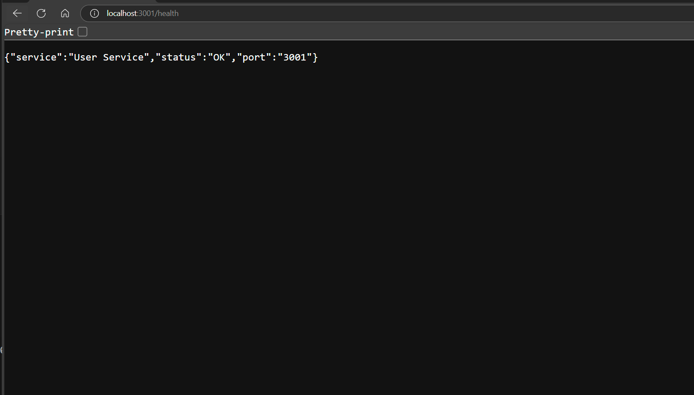
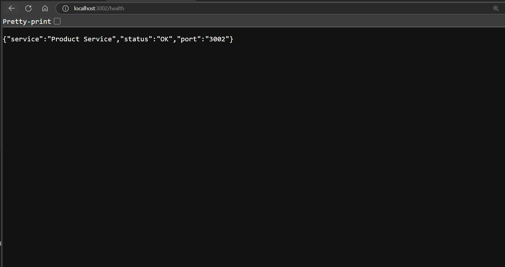
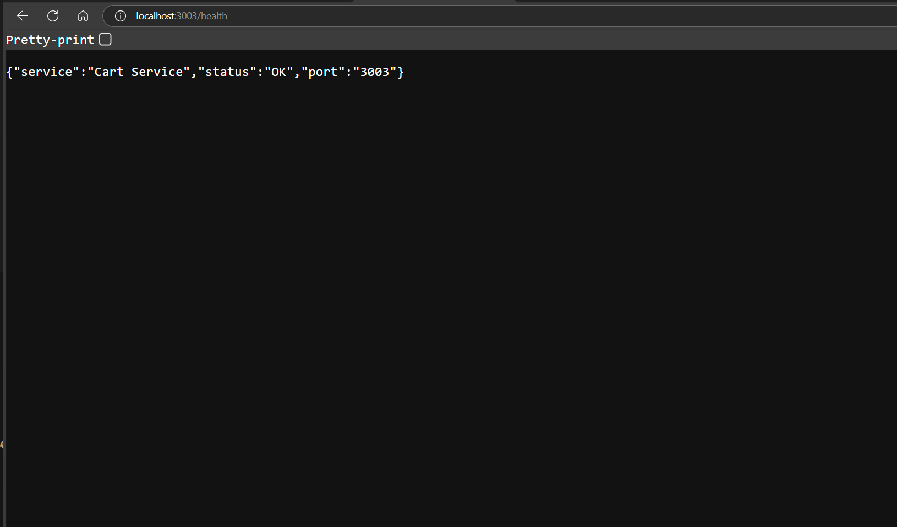
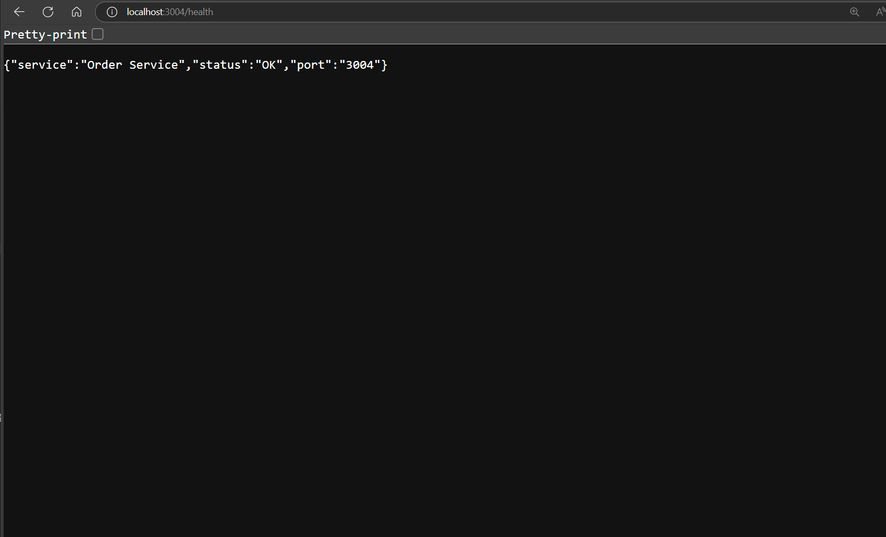

# 🛒 E-Commerce Microservices Application

A full-stack MERN e-commerce application built using microservices architecture with Docker and Docker Compose.

## 🧱 Architecture Overview

```
Frontend (React) → API Gateway → Microservices
                                 ├── User Service (3001)
                                 ├── Product Service (3002)
                                 ├── Cart Service (3003)
                                 └── Order Service (3004)
```

## 🛠️ Technology Stack

### Backend
- Node.js + Express.js
- MongoDB + Mongoose
- JWT Authentication
- RESTful APIs (Microservices)

### Frontend
- React 18
- React Router
- React Query + Context API
- Axios for API calls

## 📦 Microservices

| Service         | Port  | Responsibilities                          |
|-----------------|-------|-------------------------------------------|
| User Service    | 3001  | Registration, Login, Profile, JWT         |
| Product Service | 3002  | Products, Categories, Inventory           |
| Cart Service    | 3003  | Cart operations, item validation          |
| Order Service   | 3004  | Order management, payment simulation      |
| Frontend        | 3000  | React 18 app with all user features      |

## 🚀 Getting Started

### 1. Clone the Repository

```bash
git clone <your-repo-url>
cd E-CommerceStore
```

### 2. Add `.env` file (for Docker Compose runtime MongoDB URIs)

Create a `.env` file at the root:

```env
MONGO_URI_USERS=mongodb+srv://<username>:<password>@cluster.mongodb.net/ecommerce_users
MONGO_URI_PRODUCTS=mongodb+srv://<username>:<password>@cluster.mongodb.net/ecommerce_products
MONGO_URI_CARTS=mongodb+srv://<username>:<password>@cluster.mongodb.net/ecommerce_carts
MONGO_URI_ORDERS=mongodb+srv://<username>:<password>@cluster.mongodb.net/ecommerce_orders
JWT_SECRET=your-secret-key
```

### 3. Run Locally with Docker Compose

```bash
docker-compose --env-file .env up --build
```









This will:
- Build each microservice Dockerfile
- Inject MongoDB URIs at runtime
- Launch all services

### 4. Access the Application

| Component    | URL                       |
|--------------|---------------------------|
| Frontend     | http://localhost:3000     |
| User API     | http://localhost:3001     |
| Product API  | http://localhost:3002     |
| Cart API     | http://localhost:3003     |
| Order API    | http://localhost:3004     |

## 🐳 Push Images to Docker Hub

After building, manually push each image:

```bash
docker login

docker push xxradeonxfx/user-service
docker push xxradeonxfx/product-service
docker push xxradeonxfx/cart-service
docker push xxradeonxfx/order-service
docker push xxradeonxfx/learner-frontend
```

## 🔮 Future Enhancements

- API Gateway with NGINX or Express Proxy
- MongoDB as a container (instead of cloud)
- Redis caching layer
- Helm/Kubernetes deployment
- GitHub Actions CI/CD
- Admin dashboard & analytics
- Message queue with RabbitMQ or Kafka

## 📄 License

MIT © 2025 Prince Thakur
